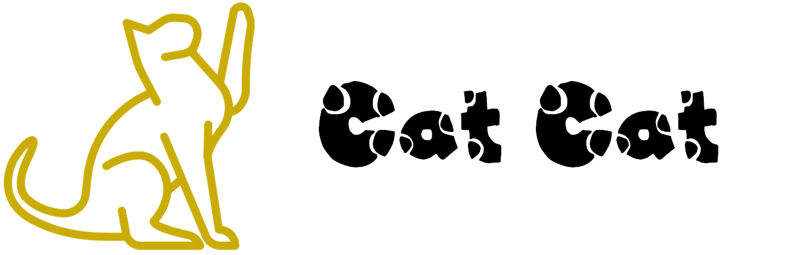
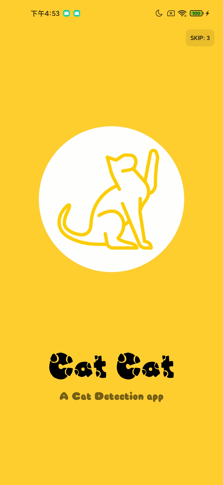
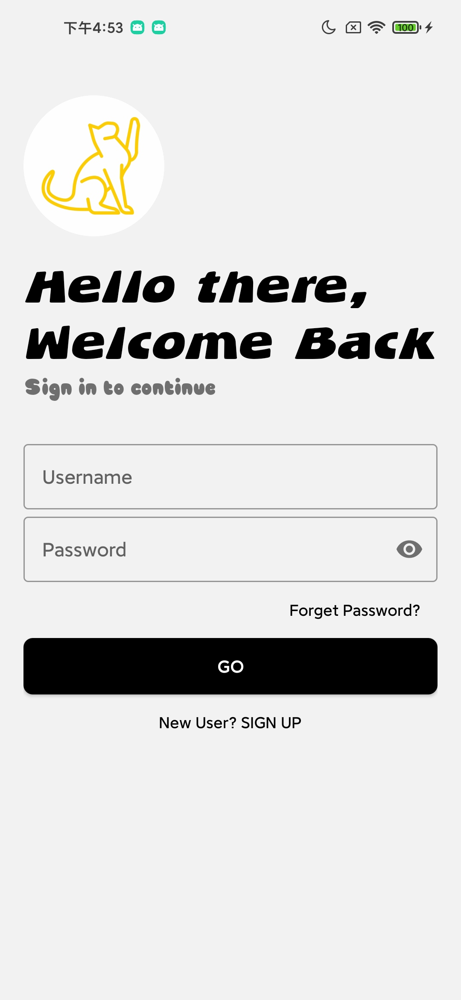
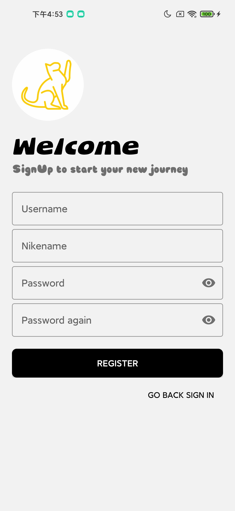
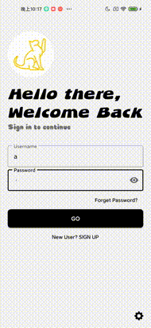
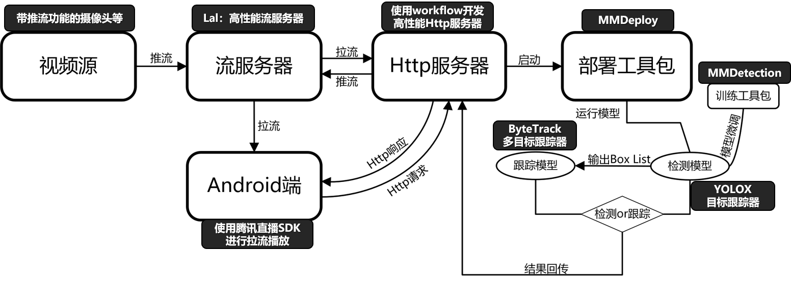

&nbsp;

&nbsp;

<h1 align="center">

Cat Cat | MMDeply $\times$ GLCC 开源项目 | MMDeploy 实践

</h1>

      
    &nbsp;
    
    &nbsp;
      

# 介绍

✨ 本项目是发起于[CCF GitLink开源编程夏令营(GitLink Code Camp, 简称GLCC)](https://www.gitlink.org.cn/). CCF GitLink 开源编程夏令营（GitLink Code Camp，简称 GLCC），是在 CCF 中国计算机学会指导下，由 GitLink 社区联合 CCF 开源发展委员会（CCF ODC）共同举办的面向全国高校学生的暑期开源项目实习计划。活动将联合各大开源企业、开源基金会、开源社区及开源领域专家，旨在鼓励高校学生通过参与真实的开源软件开发，感受开源文化，提升自身技术能力，进而达到为开源企业和社区输送优秀人才的目的。作为此次活动的特邀合作单位，OpenMMLab 设置了 12 个项目方向共 15 个课题

✨ 本项目基于[OpenMMLab](https://github.com/open-mmlab)下的子开源项目[MMDeploy](https://github.com/open-mmlab/mmdeploy)🔥🔥🔥实现的。MMDeploy 是 OpenMMLab 模型部署工具箱，为各算法库提供统一的部署体验。基于 MMDeploy，开发者可以轻松从训练 repo 生成指定硬件所需 SDK，省去大量适配时间。目前 MMDeploy 支持的算法 repo 有：mmcls、mmdet、mmdet3d、mmedit、mmocr、mmpose、mmseg、mmrazor。MMDeploy 同时支持超多推理后端：ONNX Runtime、TensorRT、ppl.nn、ncnn、OpenVINO，目前新版已经发布，快去体验一下吧🔥🔥🔥

✨ 针对如今猫猫饲养普及，但人们工作越来越忙碌，不能够照看猫猫的问题，本项目基于MMDeploy，实现了猫猫的检测识别，跟踪的一款服务，该服务主要具有以下两个功能:
* 能够对猫猫进行检测和跟踪，并将检测结果进行推流，通过手机App进行播放
* 能够对猫猫进行划线检测，也就对于猫猫进入一定区域的视频进行记录并推送给用户

目前，该项目包括两个部分:

* [能够响应Http请求，完成检测跟踪的服务器](https://github.com/DDGRCF/GLCC_Server)
* **能够发起Http请求，完成实现播放的客服端**👈 **目前位置**

**✨服务器目前支持的功能:**

- [x] 响应基础的Http请求    
- [x] 猫猫检测和跟踪 
- [x] 猫猫的越线检测
- [x] 猫猫的越线时间点视频的记录
- [x] 监控的直播视频流的推送
- [x] 监控的文件视频流的推送
- [x] 提供配置文件可拓展其他类别
- [ ] 加载SSL证书 
 
**✨客服端目前完成的功能:**

- [x] 发起基础的Http请求
- [x] 用户登录注册
- [x] 视频源登录删除
- [x] 猫猫监控的直播视频流的拉取
- [x] 猫猫记录的文件视频流的拉取
- [x] 支持服务器配置端口，IP等信息
- [ ] 加载SSL证书

# 预览

## 服务器

## 客服端
      

# 工作流程

# 安装
### 环境依赖
* **AnroidStudio** ➡️ [点击进入](https://developer.android.com/studio)
### 安装命令
使用最新AndroidStudio打开项目即可

# 开源许可证
本项目采用 [MIT](./LICENSE) 开源许可证

# 感谢以下项目
* [MMDeploy](https://github.com/open-mmlab/mmdeploy.git)
* [Workflow](https://github.com/sogou/workflow/blob/master)
* [MegFlow](https://github.com/MegEngine/MegFlow)
* [AnroidUtilCode](https://github.com/Blankj/AndroidUtilCode)
* [DiglogX](https://github.com/kongzue/DialogX)
* [Fab](https://github.com/Clans/FloatingActionButton)

# 技术交流
